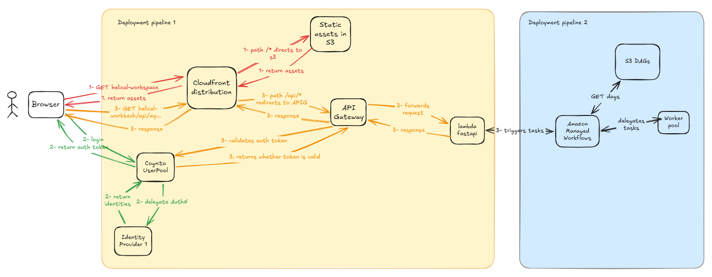

# DESIGN.md

## 1. Multiple Users: Onboarding with Limited Overhead

### Problem statement

The current application is a POC. It can be deployed to a personal laptop and potentially on an
on-premises server, but it is limited and puts the control of the software to the users and not to the
app developers limiting the ability of track usage and monetize it.

To be able to scale the application across 100 or more users poses two distinct challenges:

1. infrastructure scalability → more users imply a higher usage on the system which will go beyond a
   single machine. We need to split the application in distinct components that can scale up and
   down in function of the usage (also to save cost).
2. business scalability → Even though different users will be using the same infrastructure, we need
   to ensure that users are properly identified and permissions are enforced to avoid cross business
   side effects. In other words, we need Authentication (AuthN) and Authorization (AuthZ)

### High level proposal

Find below the high level proposal

1. We will use cloudfront distribution to be our unique entry point of our workbench. We will be
   using it since it allows to cache our assets to locations aws regions and availability zones
   that are closer to our users (minimizing first time rendering) and at the same time being
   the entry point for our backend apis (in this way we avoid having to set up CORS since all the
   api request will come from the same domain).
2. The website static assets will be stored in s3 and the cloudfront distribution will fetch our
   assets from an S3 bucket, and we won't need any server to serve them.
3. Our backend api that will be used by our front-end will be deployed to APIG + lambda combination
   that would allow us to horizontally scale with the number of request to our backend.
4. We will apply AuthN and AuthZ to our backend apis via Cognito User Pool that can be directly
   integrated to APIG.
5. The components above will be deployed via a single deployment pipeline using AWS CDK and AWS
   pipelines. The deployment pipeline will not only managed the creation of the infrastructure but
   also the update of the s3 static assets and lambda function zip files.
6. Following the current POC implementation, we will use Amazon Managed Workflows for Apache Airflow
   to manage the orchestration and execution of our batch jobs.
7. Our DAGs will be stored in S3 which will be updated via code deployment pipeline below.
8. Also, our dependencies will be either via requirements.txt read from an s3 bucket or by directly
   reading .zip file from s3 containing all the dependencies already bundled (in case that some of
   our dependencies are not published to a public repository index)
9. The batch components will be deployed via a separate code deployment pipeline which will also
   not only be in charge of managing the infrastructure but also to update the s3 assets for the
   batch jobs to be able to run.

---

## 2. Multi-Model Comparison

The current DAG is already parametrized to receive as params the data path and the model. As such,
the users can submit the different jobs and download the results. Potentially, in the future,
if there's a strong user use-case, we could create a dedicated api that can trigger multiple DAGs
concurrently and link them via some metadata

---

## 3. Failure Handling: OOM Resilience

The first option is to add retries to the dag tasks, though if the problem is OOM it will only
prevent the error if the retry happens when there's less memory pressure from other tasks.

Ideally, inference tasks could reduce the memory pressure by partially loading the inference set,
inferring, storing the result and then repeating (kind of moving to stream) instead of batch
processing.
